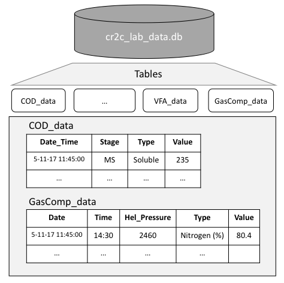
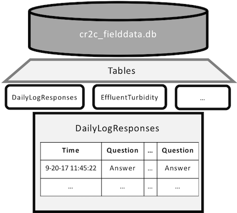
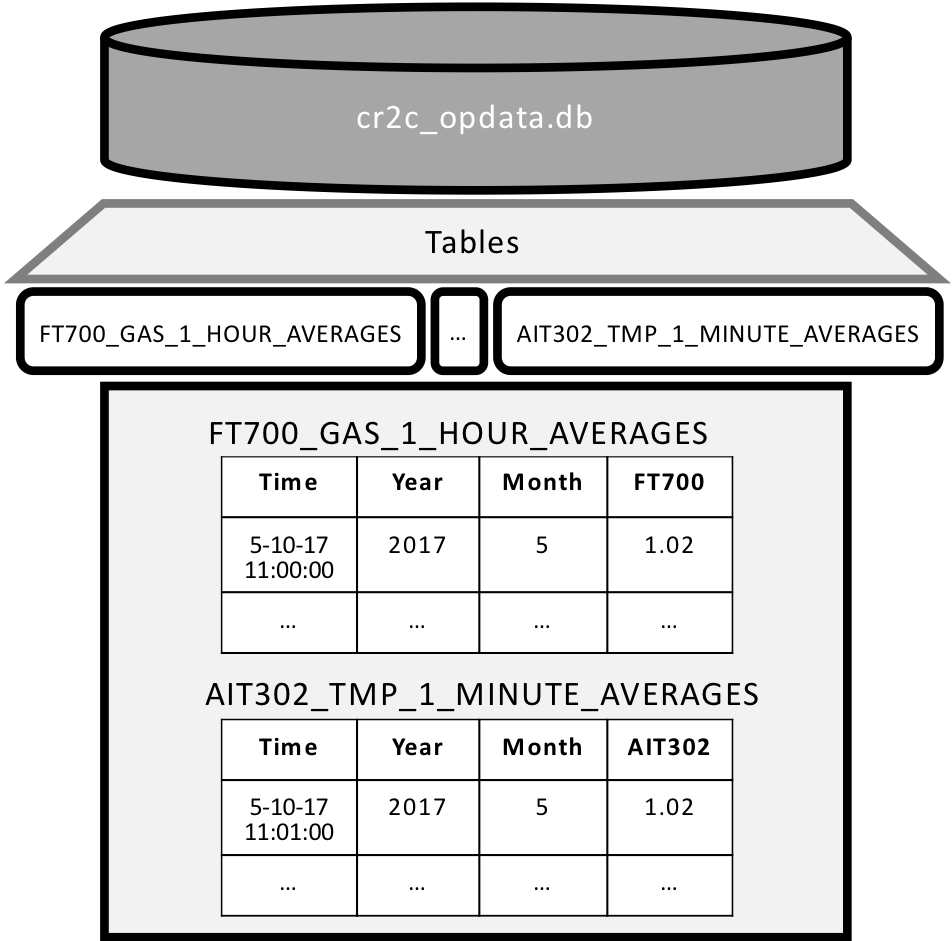

## Synopsis

The cr2c-monitoring project manages the data systems for the Bill & Cloy Codiga Resource Recovery Center (CR2C). CR2C produces three principal streams of data: laboratory data from water quality and other testing, operational data from the facility's automated sensors, and field data collected by the facility's operators in their daily checks of the plant's performance. The scripts in this repository process and output these data streams to a single data store, perform various analyses to monitor and validate the plant's performance on a day to day basis, and integrate important information from all data into a single, online visualization and data query platform. 

## contributors

The contributors to this project are managers and operators of the Codiga Center:

Sebastien Tilmans (Director of Operations)
Jose Bolorinos (Operator)
Yinuo Yao (Operator)
Andrew Hyunwoo Kim (Operator)

## Table of Contents

* [Prerequisites](#prerequisites)
* [Data Structures](#data-structures)
  * [Laboratory Data](#laboratory-data)
  * [Field Data](#field-data)
  * [Operational Data](#operational-data)
* [Documentation](#documentation)
  * [cr2c-utils](#cr2c-utils)
    * [get_gsheet_data](#get_gsheet_data)
    * [get_dirs](#get_dirs)
    * [get_credentials](#get_credentials)
  * [cr2c-labdata](#cr2c-labdata)
    * [get_data](#labget_data)
    * [labrun](#labrun)
    * [labrun.get_stage_descs](#labrunget_stage_descs)
    * [labrun.manage_dups](#labrun.manage_dups)
    * [labrun.set_var_format](#labrunset_var_format)
    * [labrun.clean_dataset](#labrunclean_dataset)
    * [labrun.wide_to_long](#labrunwide_to_long)
    * [labrun.long_to_wide](#labrunlong_to_wide)
    * [labrun.count_multichars](#labruncount_multichars)
    * [labrun.clean_wide_table](#labrunclean_wide_table)
    * [labrun.summarize_tables](#labrunsummarize_tables)
    * [labrun.process_data](#labrunprocess_data)
  * [cr2c-opdata](#cr2c-opdata)
    * [get_data](#opget_data)
    * [get_table_names](#get_table_names)
    * [cat_dfs](#cat_dfs)
    * [opdata_agg](#opdata_agg)
    * [opdata_agg.prep_opdata](#opdata_aggprep_opdata)
    * [opdata_agg.get_average](#opdata_aggget_average)
    * [opdata_agg.run_agg](#opdata_aggrun_agg)
  * [cr2c-fielddata](#cr2c-fielddata)
    * [get_data](#fldget_data)
    * [clean_varname](#clean_varname)
    * [process_data](#process_data)
  * [cr2c-validation](#cr2c-validation)
    * [cr2c_validation](#cr2c_validationclass)
    * [cr2c_validation.adj_Hcp](#cr2c_validationadj_Hcp)
    * [cr2c_validation.est_diss_ch4](#cr2c_validationest_diss_ch4)
    * [cr2c_validation.get_cod_bal](#cr2c_validationget_cod_bal)
    * [cr2c_validation.get_biotech_params](#cr2c_validationget_biotech_params)
    * [cr2c_validation.instr_val](#cr2c_validationinstr_val)

## Prerequisites

To use this repository on your machine, open a terminal window, change to the directory where you would like to place the repository, and clone the repository:

```
cd "/mydir"
git clone https://github.com/stanfordcr2c/cr2c-monitoring
```

This project is based on Python 3 and makes use of Python's data management modules, including Numpy, Pandas, and sqlite3. In addition, all interactive plotting is done with [Dash](https://dash.plot.ly/), a web application module developed by the Plotly Project, built on top of the [Flask](http://flask.pocoo.org/docs/1.0/) framework. We also make extensive use of the Google Cloud Services platform, including:

[Google App Engine](https://developers.google.com/api-client-library/python/apis/appengine/v1)

[Google BigQuery](https://cloud.google.com/bigquery/docs/reference/libraries)

[Google Sheets API](https://developers.google.com/sheets/api/guides/concepts)

All dependencies are listed in the "cr2c-dependencies.txt" document in the repository. 

We recommend that you download [Anaconda](https://www.anaconda.com/download/#macos) for easy managing and updating of virtual python environments. With Anaconda, a new virtual environment can easily be created from a dependencies file:

`conda create --name cr2c-monitoring --file cr2c-dependencies.txt`

or a list of dependencies can be installed into an existing environment: 

`conda install --name myenv --file cr2c-dependencies.txt`

See Anaconda's [documentation](https://conda.io/docs/user-guide/tasks/manage-environments.html) for more details on managing environments. 

Alternatively, all dependencies can be installed with pip:

`pip install -r cr2c-dependencies.txt`

Virtual environments can also be managed with Python 3's [venv](https://docs.python.org/3/library/venv.html) module

## Data Structures

### Laboratory Data

Raw laboratory data are entered manually into the “CR2CMonitoringData” google spreadsheet. The cr2c_labdata scripts read these data from the google spreadsheet using the Google Sheets API, verifies that dates, stages and values have been entered correctly and computes the resulting values (for example, raw COD data gives a dilution factor and a reading from the Hach spectrometer and the code computes the resulting COD value (in mg/L)). 

Cleaned lab data are inserted/updated into their respective table on the cr2c_lab_data.db data store on Codiga’s Box folder. The __Laboratory Data Schematic__ figure below shows the structure of the laboratory data. The data store contains a table for each parameter type (eg. “COD_data” table is a table containing processed COD lab data). Each table has a column indicating:
* The date and time of sample collection (“Date_Time”)
* The treatment stage of the collected sample (“Stage”, this refers to the location in the treatment plant from which the sample was collected), 
* The parameter value type (“Type”, where appropriate, eg. COD, which can either be "Total", "Soluble", or "Particulate" vs PH which can only be PH...)
* The value of the laboratory parameter (“Value”).  

__Laboratory Data Schematic:__



### Field Data

Data from monitoring forms that are filled out on site are synced to the “CR2CMonitoringProcedures” spreadsheet through the Google Forms app. In the same way as the laboratory data, these data can be downloaded from the google spreadsheet using the Google Sheets API. The cr2c_fielddata scripts clean and load the data from the Google spreadsheet where they are stored and output them to the cr2c_fielddata.db data store. 

The __Field Data Schematic__ figure below shows structure of the field data as they are currently stored in the cr2c_fielddata.db store. Somewhat analogously to a spreadsheet, each tab is a table in a data store that records the answers to a given google form (so if the name of the google form is "DailyLogSheet" the corresponding name of the table in the cr2c_fielddata.db store is "DailyLogSheet"). Each variable name in the table for a given google form is the name of the question in that form and each row is an answer to that question. For example, if the answer to the question "Operator Initials" in the "DailyLogSheet" form is "PB", this will be recorded as a value of "PB" for the variable names "Operator_Initials" in a table named "DailyLogSheet" in the cr2c_fielddata.db store. The time stamp of each form submission is automatically stored by google forms. Note: the script that processes form submissions cleans the question text string, so that the name of the variable in the form table is not identical to the text of the question in the form (see [clean_varname](#clean_varname) for details).

__Field Data Schematic:__



### Operational Data

Operational data logged by the facility's automated sensors are wired through its programmable logic controller (PLC) and transmitted to a remote data collector (i.e. server) via open platform communication (OPC). These data are then pre-processed by WonderWare's eDNA data historian, which compresses and clean's raw OPC data. Currently, these operational data are obtained by manually remoting into the data collector, running an eDNA query, and transferring the output to a local machine where further cleaning and compression are performed by the cr2c_opdata scripts. The cr2c_opdata scripts cleans operational data by removing outlying values, calculating average parameter values for a specified time period and resolution (minute-level, hourly, daily, etc), and outputting the result to the cr2c_opdata.db data store.

The __Operational Data Schematic__ below shows the structure of the operational data as they are currently stored in the cr2c_opdata.db store. Each table in the data store corresponds to a sensor id that identifies an automated sensor at the plant which in turn is specified with a sensor type that logs water flows ("WATER"), biogas flows ("GAS"), and other parameters such as pH ("PH"), temperature ("TEMP"), and trans-membrane pressure ("TMP"). Along with the sensor id and the sensor type, each table in the data store is specific to a certain level of temporal aggregation: 1 minute, 5 minutes, 1 hour, 6 hours, 1 day, etc. To illustrate how sensor data map to a table name, 1-hour average water flows read by sensor FT200 would be stored in cr2c_opdata.db in a table called "WATER_FT200_1_HOUR_AVERAGES".

Each table in the cr2c_opdata.db store contains four variables:
* The time stamp corresponding to the _start_ of the time period in question ("Time")
* The year of the time period in question ("Year")
* The month of the time period in question ("Month")
* The value read by the sensor (Value). Note, when querying these data, the "Value" variable name can be changed to the corresponding sensor id to permit easy merging of multiple sensor readings into a single wide table (see [Operational Data: get_data](#opgetdata) documentation below for more details)

__Operational Data Schematic:__



## Documentation

### cr2c-utils

__Description__: For now just a set of general-purpose methods that are useful to any of the cr2c-monitoring scripts 

<a name="get_gsheet_data"></a>
#### get_gsheet_data(*sheet_names*)

__Description:__ Retrieves data of specified tabs in a gsheets file

__Arguments:__ 
* *sheet_names*: List of gsheet names from which to obtain data

__Output:__
* _df_: Pandas dataframe with raw lab data from specified gsheet name

<a name="get_dirs"></a>
#### get_dirs()

__Description:__ Gets directories necessary for reading and outputting data in the local Box Sync folder

__Output:__
* *data_dir*: Directory with all cr2c data stores
* _pydir_: Directory with API key and client secret for google sheets API

<a name="get_credentials"></a>
#### get_credentials()

__Description:__ Gets valid user credentials from storage. If nothing has been stored, or if the stored credentials are invalid, the OAuth2 flow is completed to obtain the new credentials.

__Output:__
* _credentials_: user credentials for accessing google spreadsheet file
* _spreadsheetID_: id of the google spreedsheet file


### cr2c-labdata

<a name="labget_data"></a>
#### get_data(*ltypes, start_dt_str = None, end_dt_str = None, output_csv = False, outdir = None*) 

__Description:__ Wrapper for querying data from the cr2c_labdata.db data store

__Arguments:__ 
* *ltypes*: A list of the types of lab data the user wishes to query, these can be any of the following: 
  * 'PH' - Refers to pH measurements
  * 'COD' - Refers to Chemical Oxygen Demand measurements
  * 'TSS_VSS' - Refers to Total Suspended and Volatile Suspended Solids measurements
  * 'ALKALINITY' - Refers to alkalinity measurements
  * 'VFA' - Refers to Volatile Fatty Acid measurements
  * 'GASCOMP' - Refers to gas composition measurements (% of gas that is CO2, Methane, O2, etc)
  * 'AMMONIA' - Refers to ammonia measurements
  * 'SULFATE' - Refers to sulfate measurements
  * 'TKN' - Refers to Total Kjeldahl Nitrogen measurements
  * 'BOD' - Refers to Biochemical Oxygen Demand measurements
* *start_dt_str*: (Optional) date string to filter the result by date, sets the minimum date of the resulting data. Format MUST BE 'mm-dd-yy' so 1-1-18 for January 1st, 2018
* *end_dt_str*: (Optional) Same as *start_dt_str* but sets the maximum date of the resulting data
* *output_csv*: (Optional) Logical, if True, will output a csv file for each of the *ltypes* specified above
* *outdir*: (Optional, required if *output_csv* is True) String giving the directory to output the csv file(s) to

__Output:__
* *ldata_all*: A dictionary with the resulting data. The keys are each of the *ltypes* specified above and the values are pandas dataframes with data for the given *ltype*

__Example Caller:__
get_data(
  ltypes = ['PH','COD'],
  start_dt_str = '1-1-17',
  end_dt_str = '12-31-17',
  output_csv = True,
  outdir = 'path/to/output/dir'
)

<a name="labrun"></a>
#### labrun

__Description:__ A class for managing the cleaning and processing of laboratory data
__Inputs:__ 
  * *verbose*: (Optional) Logical (default false) indicating whether to print more error messages to log while processing lab data

<a name="labrunget_stage_descs"></a>
#### labrun.get_stage_descs()

__Description:__ Gets a more descriptive value for each of the treatment stages entered by operators into the lab data gsheet (as the variable "Stage").

<a name="labrunmanage_dups"></a>
#### labrun.manage_dups(*ltype, id_vars*)

__Description:__ Manages duplicate observations by removing duplicates (with warnings) and gets observation id's for readings with duplicate Date-Stage values (if intentionally taking multiple readings)  

__Arguments:__ 
* *ltype*: One of the ltypes specified in [get_data](#labget_data) above whose duplicates are being managed
* *id_vars*: A list of the variables that should identify a unique reading, these are usually "Date_Time", "Stage", and "Type" (if appropriate)

<a name="labrunset_var_format"></a>
#### labrun.set_var_format(*ltype, variable, var_format*)

__Description:__ Tries to format a raw input variable from gsheets data as a datetime or a floating number; outputs error message if the input data cannot be re-formatted

__Arguments:__ 
* *ltype*: One of the ltypes specified in [get_data](#labget_data) above whose data are being re-formatted
* *variable*: The name of the variable being re-formatted, as it appears in the gsheet
* *var_format*: The desired format of *variable*, in reality is either "None" (if the variable is "Date") or "float", but keeping additional flexibility in case it is needed in the future.

<a name="labrunclean_dataset"></a>
#### labrun.clean_dataset(*ltype, id_vars*)

__Description:__ Cleans the raw gsheets lab data by reformatting variables and removing duplicates (or tagging intentional duplicates)

__Arguments:__ 
* *ltype*: One of the ltypes specified in [get_data](#labget_data) above whose data are being cleaned
* *id_vars*: As in [labrun.manage_dups](#labrun.manage_dups), a list of the variables that should identify a unique reading

<a name="labrunwide_to_long"></a>
#### labrun.wide_to_long(*ltype, id_vars, value_vars*)

__Description:__ Performs a pandas melt procedure on the lab data with the right column ordering

__Arguments:__ 
* *ltype*: One of the ltypes specified in [get_data](#labget_data) above whose data are being cleaned
* *id_vars*: As in [labrun.manage_dups](#labrunmanage_dups), a list of the variables that should identify a unique reading
* *value_vars*: A list of the variables that contain the values of lab measurements taken

<a name="labrunlong_to_wide"></a>
#### labrun.long_to_wide(*df, id_vars*)

__Description:__ Performs sequential pandas unstack procedures to convert a long dataframe to a wide dataframe

__Arguments:__ 
* *df*: The input dataframe that is to be unstacked
* *id_vars*: As in [labrun.manage_dups](#labrunmanage_dups), a list of the variables that should identify a unique reading

__Output:__
* A wide pandas dataframe

<a name="labruncount_multichars"></a>
#### labrun.count_multichars(*string*)

__Description:__ Counts the characters in a string that appear more than once and outputs a string of these characters

__Arguments:__ 
* *string*: The input string whose characters are to be counted

__Output:__
* A string of the characters that appear more than once in the input string

<a name="labrunclean_wide_table"></a>
#### labrun.clean_wide_table(*dfwide, value_vars, start_dt, end_dt, add_time_el*)

__Description:__ Cleans the wide table of lab data results

__Arguments:__ 
* *dfwide*: A wide pandas dataframe of the cleaned lab data
* *value_vars*: A list of variables that refer to lab measurements
* *start_dt*: A datetime variable for the minimum desired date 
* *end_dt*: A datetime variable for the maximum desired date 
* *add_time_el*: Logical, whether or not to add the days since the reactors were seeded to the wide tables

__Output:__
* A clean, wide pandas dataframe

<a name="labrunsummarize_tables"></a>
#### labrun.summarize_tables(*end_dt_str, ndays, add_time_el = True, outdir = None, opfile_suff = None*)

__Description:__ Combines and filters a set of wide tables and outputs the resulting table as a csv file

__Arguments:__ 
* *end_dt_str*: A string for the last date for which data should be included in wide tables, format should be 'mm-dd-yy' as in '1-1-18' for Jan 1, 2018
* *ndays*: Integer, the number of days to look back relative to end_dt_str
* *add_time_el*: Logical, whether to include a variable in the table indicating the time elapsed since seeding the reactor
* *outdir*: A string indicating the output directory of the csv file
* *opfile_suff*: An optional string that will be appended to the csv output file

__Output:__
* A csv file with clean and combined wide tables

<a name="labrunprocess_data"></a>
#### labrun.process_data()

__Description:__ The main caller that executes all methods to read data from Google Sheets, clean and reformat it. Performs necessary computations on laboratory results, converts all data to a long format, and outputs the result to the cr2c_labdata.db data store.

### cr2c-opdata

<a name="opget_data"></a>
#### get_data(*stypes, sids, tperiods, ttypes, combine_all = True, year_sub = None,  month_sub = None, start_dt_str = None, end_dt_str = None, output_csv = False, outdir = None*)

__Description:__ Wrapper for querying aggregated data from the cr2c_opdata.db data store. Note that for the data to be available, [opdata_agg.run_agg](#opdata_aggrun_agg) has to have already been run for the data point in question

__Arguments:__
* *stypes*: A list of sensor types corresponding to each sensor id given in *sid* below (in the same order!). These types can be any of:
  * "WATER": Sensors that measure flows of water through the treatment plant
  * "GAS": Sensors that measure flows of gas from the plant's reactors
  * "TEMP": Sensors that measure temperature of water at various points in the treatment process
  * "TMP": Sensors that measure the trans-membrane pressure in the plant's membrane bioreactors 
  * "PRESSURE": Sensors the measure pressure in the reactors
  * "PH": Sensors that measure pH at various points in the treatment process
  * "DPI": Sensors that measure differential pressure in the reactors' recirculation loops
  * "LEVEL": Sensors that measure water levels at various points in the treatment process
* *sids*: A list of sensor ids  of length equal to *stypes* whose aggregated data we want
* *tperiods*: A list of integers of length equal to *stypes* giving the lengths of the time periods for which we are obtaining aggregated data.
* *ttypes*: A list of time period type strings of length equal to *stypes* giving the time period "type" corresponding to the time period length for which we are obtaining aggregated data. These strings can be "MINUTE" or "HOUR"
* *combine_all*: (Optional) Logical indicating whether the list of tables being queried should be output as a single wide dataframe or not.
* *year_sub*: (Optional) Integer indicating which year we want aggregated data for
* *month_sub*: (Optional) Integer indicating which month we want data for
* *start_dt_str*: (Optional) String of format 'mm-dd-yy' giving the earliest date for which we want data
* *end_dt_str*: (Optional) String of format 'mm-dd-yy' giving the latest date for which we want data
* *output_csv*: (Optional) Logical, if true will output aggregated data to csv file(s) (depending on whether *combine_all* is True or False)
* *outdir*: (Optional, required if *output_csv* is True) String giving the directory to output csv file(s) to

__Output:__
* A single dataframe or dictionary of dataframes with keys equal to the table names in the SQL file. If a single dataframe is output, all dataframes will be merged on time and the value of each sensor id will be a variable with name "sid". If a dictionary of tables, the table name will be *"stype"_"sid"_"tperiod"_"ttype"_AVERAGES*, so for example, WATER_FT200_6_HOUR_AVERAGES for sid "FT200", which measures flows of "WATER" averaged over 6 hour periods)

__Example Caller:__
The following example gets 1-hour averages for sensors FT200, FT305 and FT700 for November 2017 (can be specified through the "year_sub" and "month_sub" arguments or with the "start_dt_str" and "end_dt_str" arguments)
get_data(
  stypes = ['WATER','WATER','GAS'],
  sids = ['FT200','FT305','FT700'],
  tperiods = [1, 1, 1],
  ttypes = ['HOUR','HOUR','HOUR'],
  year_sub = 2017
  month_sub = 11,
  start_dt_str = '1/11/17',
  end_dt_str = '30/11/17',
  output_csv = True,
  outdir = 'path/to/my/dir'
)

<a name="get_table_names"></a>
#### get_table_names()

__Description:__ Get a list of the table names in the cr2c_opdata.db data store
__Output:__ A list of table names 

<a name="cat_dfs"></a>
#### cat_dfs(ip_paths, idx_var = None, output_csv = False, outdir = None, output_dsn = None)

__Description:__ Concatenates a list of csv files in a directory to a single dataframe
__Arguments:__
  * *ip_paths*: A list of strings giving the paths to each csv file
  * *idx_var*: (Optional), String referring to the index variable common to all of the data frames. If given, the stacked data will be sorted by this variable
  * *output_csv*: (Optional), Logical, if true will output a csv of the stacked dataframes
  * *outdir*: (Optional, required if *output_csv* is True), String giving the directory to output stacked dataframes
  * *output_dsn*: (Optional, required if *output_csv* is True), String giving the name of the output stacked dataframes csv file

__Output:__
* A Pandas stacked dataframe

<a name="opdata_agg"></a>
#### opdata_agg

__Description:__ A class for managing the cleaning and aggregation of operational (sensor) data
__Inputs:__ 
  * *start_dt_str*: A string of format 'mm-dd-yy' giving the first date for which aggregated data are desired
  * *end_dt_str*: A string of format 'mm-dd-yy' giving the last date for which aggregated data are desired
  * *ip_path*: A string giving the directory containing the csv file with raw sensor data

<a name="opdata_aggprep_opdata"></a>
#### opdata_agg.prep_opdata(stype, sid)

__Description:__ Reads in a csv of raw sensor data, cleans and re-formats variables, removes missing values.
__Arguments:__ 
  * *stype*: The type of sensor whose operational data are being prepped (types can be one of stypes described in [get_data](#opget_data) above)
  * *sid*: The id of the sensor whose operatioal data are being prepped (data for each sensor are processed separately)
__Output:__

<a name="opdata_aggget_average"></a>
#### opdata_agg.get_average(opdata, tperiod, ttype)

__Description:__ Uses linear interpolation to convert a dataframe of sensor readings with arbitrary time stamps into periodic averages
__Arguments:__
  * *opdata*: A clean and prepped pandas data frame with readings for a given sensor
  * *tperiod*: An integer giving the length of the time period for which averages are being obtained
  * *ttype*: A string giving the time period unit, can be either "HOUR" or "MINUTE"
__Output:__
* A pandas dataframe with periodic interpolated average readings for a sensor


<a name="opdata_aggrun_agg"></a>
#### opdata_agg.run_agg(stypes, sids, tperiods, ttypes, output_csv = False, output_sql = True, outdir = None)

__Description:__ Runs a report to obtain aggregated data for a series of stypes, sids, tperiods and ttypes in series. Outputs the result to the cr2c_opdata.db data store, and, if requested, to a series of csv files
__Arguments:__
  * *stypes*: A list of strings giving type of sensor whose operational data are being prepped (types can be one of stypes described in [get_data](#opget_data) above)
  * *sids*: A list of sensor ids  of length equal to *stypes* whose aggregated data we want
  * *tperiods*: A list of integers of length equal to *stypes* giving the lengths of the time periods for which we are obtaining aggregated data.
  * *ttypes*: A list of time period type strings of length equal to *stypes* giving the time period "type" corresponding to the time period length
  * *output_csv*: (Optional) Logical, if true will output aggregated data to csv file(s) (depending on whether *combine_all* is True or False)
  * *output_sql*: (Optional) Logical, if true will output aggregated data to the cr2c_opdata.db data store
  * *outdir*: (Optional, required if *output_csv* is True) String giving the directory to output csv file(s) to

__Example Caller:__

opdata_agg.run_agg(
  stypes = ['WATER','WATER','GAS'],
  sids = ['FT200','FT305','FT700'],
  tperiods = [1, 1, 1],
  ttypes = ['HOUR','HOUR','HOUR'],
  output_csv = True,
  outdir = 'path/to/my/dir'
)

### cr2c-fielddata

<a name="fldget_data"></a>
#### def get_data(varNames = None, start_dt_str = None, end_dt_str = None, output_csv = False, outdir = None)

__Description:__ Wrapper for querying aggregated data from the cr2c_fielddata.db data store. 
__Arguments:__
* *varNames*: (Optional) A list of strings giving the names of the variables for which we want data. If not specified, all of the response data will be returned. All variable names recorded in the data store are capitalized so the input variable names argument is not case sensitive.  Note: For any variable in the form, the variable name in the data store will have all special characters removed, and all spaces replaced with a '_'.
* *start_dt_str*: (Optional) String of format 'mm-dd-yy' giving the first date for which we want data
* *end_dt_str*: A string of format 'mm-dd-yy' giving the last date for which we want data
* *output_csv*: (Optional) Logical, if true will output aggregated data to csv file
* *outdir*: (Optional, required if *output_csv* is True) String giving the directory to output csv file to
__Output:__
* A pandas dataframe with the form data

__Example Caller:__

get_data(
  varNames = ['Operator_Initials','Barometer_Pressure_mmHg'],
  start_dt_str = '01-01-17',
  end_dt_str = '12-31-17',
  output_csv = True,
  outdir = 'path/to/my/dir'
)

<a name="clean_varname"></a>
#### clean_varname(varname)

__Description:__ Cleans a variable name in the log sheet form by eliminating all special characters and replacing spaces with a '\_' and converting all characters to upper-case.
__Arguments:__
  * *varname*: A variable name string

__Output:__
* A clean variable name string

<a name="process_data"></a>
#### process_data(tableName = 'DailyLogResponses')

__Description:__ Processes responses from daily log form by reading data in from google sheet and cleaning variable values. Outputs result to the cr2c_fielddata.db data store.
__Arguments:__ 
  * *tableName*: (Optional) A string giving the name of the table whose responses are to be processed. This corresponds to the sheetname of the google sheets file where the google form responses are stored and the name of the google form itself

### cr2c-validation

<a name="cr2c_validationclass"></a>
#### cr2c_validation

__Description:__ A class for managing the validation exercises performed on the integrated lab, field and operational sensor data
__Inputs:__
  * *outdir*: A string giving directory to output the results of validation exercises to
  * *ip_path*: (Optional, required if any of *run_agg_feeding*, *run_agg_gasprod*, *run_agg_temp*, or *run_agg_press* are True) A string giving the path to the dataset that contains raw sensor data that will be used to execute an opdata_agg.run_agg method, if desired.
  * *run_agg_feeding*: (Optional) Logical, if True will execute an opdata_agg.run_agg method on the sensors measuring reactor feeding
  * *run_agg_gasprod*: (Optional) Logical, if True will execute an opdata_agg.run_agg method on the sensors measuring reactor gas production
  * *run_agg_temp*: (Optional) Logical, if True will execute an opdata_agg.run_agg method on the sensors measuring temperature
  * *run_agg_press*: (Optional) Logical, if True will execute an opdata_agg.run_agg method on the sensors measuring reactor pressure

<a name="cr2c_validationadj_Hcp"></a>
#### cr2c_validation.adj_Hcp(Hcp_gas, deriv_gas, temp)

__Description:__ Computes an adjusted Henry's constant (in concentration/pressure units) for a given gas and temperature
__Arguments:__ 
  * *Hcp_gas*: The Henry's constant of the gas at STP (in concentration/pressure units)
  * *deriv_gas*: The Clausius-Clapeyron constant for the gas
  * *temp*: The gas temperature
__Output:__
* Floating number giving the adjusted Henry's constant of the gas (in concentration/pressure units)

<a name="cr2c_validationest_diss_ch4"></a>
#### cr2c_validation.est_diss_ch4(temp, percCH4)

__Description:__ Estimates the dissolved methane concentration for a given temperature and gas composition in a reactor (pressure of 1 atm)
__Arguments:__
  * *temp*: The temperature at which to estimate the dissolve methane concentration
  * *percCH4*: The percentage of gas in a reactor that is composed of methane
__Output:__ A floating number giving the assumed liquid concentration of methane at a pressure of 1 atm

<a name="cr2c_validationget_cod_bal"></a>
#### cr2c_validation.get_cod_bal(end_dt_str, nweeks, plot = True, table = True)

__Description:__ Computes a Chemical Oxygen Demand (COD) balance for the treatment plant on a weekly basis using flowrate data, COD concentrations, and biogas production. Outputs plots and csv files

__Arguments:__
  * *end_dt_str*: A string of format 'mm-dd-yy' giving the date from which to start counting *nweeks* weeks back
  * *nweeks*: The number of weeks to compute the COD balance for
  * *plot*: (Optional) Logical, if True will output a bar chart of the COD balance
  * *table*: (Optional) Logical, if True will output csv file with the COD balance data

__Example Caller:__

cr2c_validation.get_cod_bal(
  '1-12-17',
  12,
  plot = True,
  table = True
)

<a name="cr2c_validationget_biotech_params"></a>
#### cr2c_validation.get_biotech_params(end_dt_str, nWeeks, plot = True, table = True)

__Description:__ Computes key solids wasting and growth parameters to monitor biology in reactors on a weekly basis
__Arguments:__
  * *end_dt_str*: A string of format 'mm-dd-yy' giving the date from which to start counting *nweeks* weeks back
  * *nweeks*: The number of weeks to compute solids wasting and growth parameters for
  * *plot*: (Optional) Logical, if True will output a plot of solids wasting and growth parameters
  * *table*: (Optional) Logical, if True will output csv file with the solids wasting and growth parameters

__Example Caller:__

cr2c_val = cr2c_validation(outdir = 'path/to/out/dir')
cr2c_val.get_biotech_params(
  '1-12-17',
  12,
  plot = True,
  table = True
)

<a name="cr2c_validationinstr_val"></a>
#### cr2c_validation.instr_val(valtypes, start_dt_str, end_dt_str, op_sids, fld_varnames = None, ltypes = None, lstages = None, run_op_report = False, ip_path = None)

__Description:__ General purpose function for validating measurements from the facility's sensors with laboratory or field measurement data logged and stored in the cr2c_labdata.db and cr2c_fielddata.db data stores.

__Arguments:__
  * *valtypes*: A list of strings corresponding to the operational sensor data types outlined in [Operational Data: get_data](#opget_data)
  * *op_sids*: List of strings the same length as *val_types* giving the ids of the sensors that are being validated
  * *start_dt_str*: String of format 'mm-dd-yy' giving the first date for which we want to validate sensors
  * *end_dt_str*: String of format 'mm-dd-yy' giving the last date for which we want to validate sensors
  * *fld_varnames*: (Optional, refers to field measurements that correspond to the *op_sids* being validated) List of tuples of strings of length equal to *val_types* indicating appropriate field measurement(s). For differential pressure sensors, this is typically a list of tuples of two strings: one for the upstream manometer measurement and one for the down stream manometer measurement (both are needed to validate a sensor's differential pressure reading)
  * *ltypes*: (Optional, refers to lab measurements that correspond to the *op_sids* being validated) List of strings of length equal to *val_types* giving laboratory data types being used for validation
  * *lstages*: (Optional, refers to lab measurements that correspond to the *op_sids* being validated) List of strings of length equal to *val_types* giving treatment stages from which samples were collected and laboratory measurements have been saved. These stages are long/descriptive stage names. A list of current long/descriptive stage names that could be selected for validation are
      * 'Microscreen'
      * 'Duty AFMBR MLSS'
	  * 'Research AFMBR MLSS'
  * *run_op_report*: (Optional) Logical, if True will execute an opdata_agg.run_agg method on the sensor(s) being validated
  * *ip_path*: (Optional, required if *run_op_report* is True) A string giving the path to the dataset that contains raw sensor data that will be used to execute an opdata_agg.run_agg method, if desired.

__Example Caller:__

cr2c_val = cr2c_validation(outdir = 'path/to/out/dir')
cr2c_val.instr_val(
  valtypes = ['PH','PH'],
  start_dt_str = '1-1-17',
  end_dt_str = '12-31-17',
  hmi_sids = ['AT203','AT305'],
  ltypes = ['PH','PH'], 
  lstages = ['Microscreen','AFBR']
)

